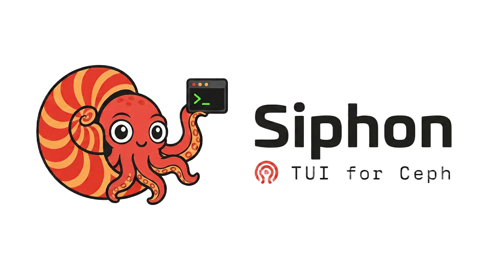

<p align="center">
  
</p>

<p align="center">
  <a href="./LICENSE"></a>
  
  
  
</p>

<p align="center">
  <b>Keyboard-driven Terminal UI for Ceph, inspired by <a href="https://k9scli.io/">k9s</a>.</b>
</p>

> [!NOTE]
> **Siphon was previously named Argonaut** — renamed to avoid confusion with Ceph's own [Argonaut](https://docs.ceph.com/en/latest/releases/argonaut/) release.

Stop memorizing long `ceph` commands. Browse your cluster, inspect resources, and
perform common operational tasks through a fast, intuitive terminal interface.

Siphon replaces repetitive Ceph CLI workflows with an interactive terminal
interface while staying transparent: every action shows the underlying Ceph
operation, and destructive changes always require confirmation.

<p align="center">
  
</p>

---

## Why Siphon?

Ceph ships an excellent CLI — but many operational workflows mean long command
sequences, remembering exact flags, or juggling several terminal windows.

Siphon gives you:

- **Fast keyboard navigation** across every resource
- **Safe destructive actions** — always confirmed, never a surprise
- **Real-time cluster visibility** — health, capacity, IO and recovery at a glance
- **Transparent execution** — every action previews the exact `ceph` command it runs

---

## Features

- **Dashboard** — health (with a scrollable `ceph health detail`), capacity (cluster-wide plus the fullest pools), client IO and recovery, refreshed live.
- **OSDs** — mark in/out, reweight, destroy/purge/remove, metadata and utilisation.
- **Pools** — create, edit (size/min_size/PG/autoscale/rule), delete.
- **CRUSH** — interactive hierarchy tree; move buckets, view rules.
- **Cluster flags** — view/toggle with descriptions, rationale and risks.
- **Services** — cephadm services and daemons; restart, start, stop.
- **Placement groups** — cluster-wide listing, live filter, scrub / deep-scrub / repair.
- **Consistent UX** — `/` filters any table, `:` command prompt, and `y`/`n`
  confirmations that always preview the equivalent `ceph` command.

---

## Installation

> Siphon manages a real cluster through **librados** (via
> [go-ceph](https://github.com/ceph/go-ceph) + cgo), so it runs on **Linux**. See
> [Requirements](#requirements) for the full support matrix.

### Download a prebuilt binary (recommended)

Prebuilt **linux/amd64** binaries are attached to each
[GitHub Release](https://github.com/cinpol/siphon/releases). Install the Ceph
client runtime libraries first:

```sh
# Debian/Ubuntu
sudo apt-get install -y librados2 librbd1
# RHEL/Rocky/Alma/Fedora
sudo dnf install -y librados2 librbd1
```

Then download, verify and install the binary (replace `v0.1.0` with the latest
release):

```sh
VERSION=v0.1.0
BASE="https://github.com/cinpol/siphon/releases/download/$VERSION"

curl -LO "$BASE/siphon_${VERSION#v}_linux_amd64.tar.gz"
curl -LO "$BASE/checksums.txt"

# Verify the download
sha256sum --ignore-missing -c checksums.txt

# Extract and install
tar xzf "siphon_${VERSION#v}_linux_amd64.tar.gz"
sudo install -m 0755 siphon /usr/local/bin/siphon

siphon --version
sudo siphon          # --client auto
```

`arm64` and other package channels (Homebrew, deb/rpm) are planned for later
releases — until then, other platforms build from source.

### Build from source

Install the build packages (see [Requirements](#requirements)), then:

```sh
git clone https://github.com/cinpol/siphon.git
cd siphon
make build
sudo ./bin/siphon          # --client auto
```

`sudo` (or another user that can read the admin keyring) lets librados
authenticate the way the `ceph` CLI does.

### Try it without a cluster

Build the pure-Go binary that talks only to an in-memory mock — works on any OS,
no Ceph required:

```sh
make build-mock
./bin/siphon-mock --client mock
```

---

## Requirements

### Platforms

| Platform | Status | Notes |
|----------|:------:|-------|
| Linux `amd64` | ✅ | Prebuilt binaries; the primary tested target. |
| Linux `arm64` | ⚠️ | Should build from source; prebuilt binaries are planned and it is not yet tested. |
| macOS / Windows | ❌ | librados is not available; only the mock client runs, for development/demos. |

### Ceph releases

Siphon targets the currently maintained Ceph releases:

| Release | Major |
|---------|:-----:|
| Reef | 18 |
| Squid | 19 |
| Tentacle | 20 |

### Linux distributions

Build-tested in CI against Ubuntu 22.04 / 24.04, Debian 12 / 13 and
AlmaLinux 9 (which also covers binary-compatible RHEL / Rocky 9). Any
distribution shipping a supported Ceph client release should work; the
constraint is the **Ceph client version**, not the distro itself.

### System packages

**To run** a prebuilt binary you need the Ceph client shared libraries; **to
build from source** you also need the development headers, a C compiler and
`pkg-config`:

| Distro family | Runtime | Build |
|---------------|---------|-------|
| Debian / Ubuntu | `librados2 librbd1` | `librados-dev librbd-dev gcc pkg-config` |
| RHEL / Rocky / Alma / Fedora | `librados2 librbd1` | `librados-devel librbd-devel gcc pkgconf-pkg-config` |

Building from source also needs **Go 1.26+**.

### Cluster access

Siphon authenticates exactly like the `ceph` CLI: it needs a reachable cluster
with a valid **`ceph.conf`** and a client **keyring**. If `ceph -s` works from
the host (as the user running Siphon), Siphon will connect too.

---

## Usage

```sh
siphon [flags]
```

| Flag | Default | Description |
|------|---------|-------------|
| `--client` | `auto` | `auto` \| `mock` \| `goceph` |
| `--ceph-conf` | *(librados default)* | Path to `ceph.conf`, overriding app config |
| `--version` | | Print version information and exit |

`--client auto` uses the native go-ceph transport and errors with guidance if
librados is unavailable — it never silently shows mock data. Use `--client mock`
to explicitly run against the built-in demo cluster.

### Keys

- `1`–`7` — switch views; `:` — command prompt (e.g. `:osd`)
- `/` — filter the current table live
- `Enter` — details for the selected item; on the Dashboard it opens a scrollable
  `ceph health detail`. Context actions use the shortcut keys shown in the header
- Inside the Health-detail overlay: `↑`/`↓`, `PgUp`/`PgDn`, `g`/`G` scroll; `Esc` closes
- `q` — quit

---

## Configuration

Optional, loaded from `~/.config/siphon/config.yaml` (honours
`XDG_CONFIG_HOME`). Built-in defaults are used when absent.

```yaml
ceph:
  config_path: ""          # empty = librados default search path
  user: client.admin
ui:
  refresh_seconds: 5
  dashboard_pool_rows: 5   # pools shown on the dashboard (fullest first); rest → Pools view
```

---

## Architecture at a glance

Strict separation of concerns; the dependency direction always points inward:

```
cmd/siphon         entrypoint: wiring only
        │
        ▼
internal/ui          Bubble Tea app (Model/Update/View), views, styles
        │
        ▼
internal/service     business logic & safety/confirmation workflows
        │
        ▼
internal/ceph        Client interface — the ONLY seam to Ceph
   ├── goceph        native librados transport (build tag: goceph)
   ├── mock          in-memory client for dev/tests (no cluster needed)
   └── decode        version-aware parsing of Ceph admin-command JSON
internal/model       transport-agnostic domain types
internal/version     Ceph release matrix + build info
internal/config      app config (XDG YAML)
```

Only implementations under `internal/ceph` import a concrete transport
(go-ceph). Everything else depends on the `ceph.Client` interface, which keeps
the app testable against the mock and free of any single transport.

---

## Status

Siphon is under active development. Implemented so far:

- ✅ Dashboard
- ✅ OSDs
- ✅ Pools
- ✅ CRUSH
- ✅ Cluster flags
- ✅ Services
- ✅ Placement groups

More resources and workflows are on the way, with partial-failure resilience and
stale-data handling throughout.

---

## Development

```sh
make test               # unit + end-to-end (mock) tests
make vet
make fmt
```

The native go-ceph transport (`internal/ceph/goceph`) is gated behind the
`goceph` build tag because it requires cgo and librados. The default (untagged)
build uses the in-memory mock, so development and CI need no cluster or C
libraries.

Contributions are welcome — see [CONTRIBUTING.md](./CONTRIBUTING.md).

---

## Acknowledgements

Siphon is inspired by the excellent work behind [k9s](https://k9scli.io/),
bringing a similar keyboard-driven operational experience to Ceph clusters. It is
built on [Bubble Tea](https://github.com/charmbracelet/bubbletea) and
[go-ceph](https://github.com/ceph/go-ceph).

---

## License

Licensed under the [Apache License 2.0](./LICENSE). See [NOTICE](./NOTICE) for
attribution and third-party components. Siphon links the Ceph client libraries
(librados/librbd, LGPL-2.1) dynamically when built with the `goceph` tag.
